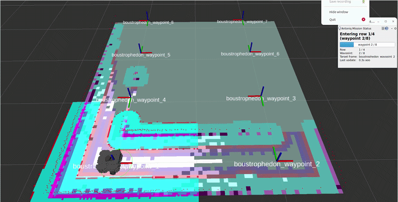

# antoniq_exercise_ws

[](https://github.com/panagelak/antoniq_exercise_ws/actions/workflows/ci.yml)
[](https://github.com/panagelak/antoniq_exercise_ws/actions/workflows/format-cpp.yml)
[](https://github.com/panagelak/antoniq_exercise_ws/actions/workflows/format-python.yml)

A ROS 2 (Jazzy) + Gazebo (gz sim, Harmonic) dev workspace that simulates a TurtleBot3
Waffle navigating a greenhouse-style field of crop rows, and maps/navigates it with
Nav2. 

The robot uses the StraightLineBased global planner to navigate on the rows and the GridBased for the turns. The local controller is the MPPIController on both cases. 

When the robot detects an obstacle in the row. The waypoints change orientation and they flip ids on each row.

Then the robot backs off, using a different local controller and goes again to the start of the row. Then it turns into the next row.

## Mission Video



```bash
# Build instructions for the dev workspace

# 1. Clone the repo, then open it in VS Code with the "Dev Containers" extension
#    installed (ms-vscode-remote.remote-containers).
git clone https://github.com/panagelak/antoniq_exercise_ws
code antoniq_exercise_ws

# 2. Reopen in container: Ctrl/Cmd+Shift+P -> "Dev Containers: Reopen in Container".
#    This builds .devcontainer/Dockerfile and drops you into a ROS 2 Jazzy +
#    Gazebo Harmonic environment with an NVIDIA GPU passed through (requires the
#    NVIDIA Container Toolkit on the host; see runArgs --gpus=all in
#    .devcontainer/devcontainer.json).

# 3. Inside the container, build the workspace:
colcon build --symlink-install
source install/setup.bash
```

---

## 2. Greenhouse world & bringup parameters (`antoniq_bringup`)

`turtlebot_bringup.launch.py` procedurally generates a greenhouse world
(`worlds/greenhouse.sdf.xacro`) instead of loading a fixed world file, with these
launch arguments (defaults in parentheses):

```bash
# Bringup the world and waffle robot
ros2 launch antoniq_bringup turtlebot_bringup.launch.py row_count:=4 row_length:=2.5 row_width:=0.8 headland_extension:=0.8

# Wait for the robot and start the mission
ros2 launch antoniq_bringup antoniq_mission.launch.py row_count:=4
```

## 3. Tuning for Narrow turns

**How `inflation_radius` and `cost_scaling_factor` interact.** Nav2's
`InflationLayer` doesn't just mark obstacle cells as lethal — it spreads a decaying
cost outward from every obstacle so the planner prefers a path that keeps its
distance, not just one that avoids literal collision. For a free cell whose
distance from the nearest obstacle is `d`:

- `inflation_radius` is the cutoff distance: beyond it, the cell gets **zero**
  added cost (it's how *far* the cost gradient reaches from a wall).
- `cost_scaling_factor` controls how *steeply* that cost falls off with distance
  inside the radius (`cost ∝ exp(-cost_scaling_factor · d)`): a larger factor
  means the cost collapses toward zero within a short distance of the obstacle,
  a smaller factor spreads a meaningfully high cost much further out.


The global costmap has a higher inflation radius 0.3, in order for the GridBased planner to calculate planner sufficiently away from the obstacles, while the local costmap has a slightly lower inflation radius 0.2 to be able to approach them more in narrow corridos. The cost_scaling_factor is larger to have lower cost at the edges of the inflation radius.

I added the *TwirlingCritic* on the MPPIController to penalize trajectory candidates (after they have been sampled) that rotate in place / spin without making forward progress, because the robot sometimes while turning and hittting the inflation radius spinned on the opposite direction.

*wz_std*: directly controls how wide a spread of turning rates gets explored and blended into that average each cycle. A larger wz_std (the reference's 0.4) means some sampled trajectories swing to much sharper turning rates than the current mean; even when the critics down-weight the worst ones, a wider spread of samples entering that weighted average makes the resulting commanded wz noisier/twitchier step to step. Narrowing it to 0.3 tightens the sampled turning-rate distribution around the current mean, producing a smoother, more damped angular command — reinforcing the same "avoid unnecessary turning/twirling" goal as enabling TwirlingCritic, just applied at the sampling stage rather than the cost stage.


Another option would be to use a more focused global planner for the turns, so it calculates global plans more semi-circle style.

## 4. Recovery Behavior

The recovery behavior when an obstacle is detected, is to stop/cancel the current nav goal, backoff with a new planner in reverse and return to the starting position of the row, then turn into the next row.

I chose to implement this logic on the Mission Node rather than directly on the Nav2 behavior trees for simplicity, since it will require major modifications on the behavior trees that arleady have complex custom bt control nodes and their purpose usually are go from A to B and not try to go to B if not succeeded for a specific reason (obstacle in row detected) return to A. 

However we could add the ObstacleMonitor logic as an condition node on the nav2 behavior tree to imediately abort the Navigation, ignoring the retry attempts, which would then simplify the mission node.

This approach let us use the default Nav2 Bt trees and provide more easily the Mission State for our use case.

## 5. Bonus

### a.

```bash
This repo is implemented in a dev container fashion
```

### b.how you would swap TurtleBot3's base for a custom ros2_control hardware interface

```bash
# spawn the turtlebot with the diff drive controller (does not behave very well)
ros2 launch antoniq_bringup turtlebot_bringup.launch.py use_ros2_control:=true
```

The hardware interface purpose is to move the robot joints, in this case simulated gazebo joints from robot agnostic controllers and do the appropriate switching when we change controllers (e.g from position/velocity/torque). So i would create and export my own hardware interface plugin guided by the default hardware interface plugin *gz_ros2_control/GazeboSimSystem*

### c. Tests (`antoniq_nodes`)

Two automated tests back the mission node, at two different levels:

**Unit test — `test/test_mission_logic.cpp` (gtest)**

`antoniq_mission_node.cpp`'s `runMission()` waypoint sequencing depends on a handful of pure
arithmetic/string rules (waypoint count from row count, which waypoints are within-row vs.
turn legs, which row a waypoint belongs to, its TF frame name, its human-readable status
string). These were pulled out into free functions in `include/antoniq_nodes/mission_logic.hpp`
specifically so they don't need an `rclcpp::Node`, a TF buffer, or any of the
action/service servers the rest of the mission node depends on — they're deliberately
"ROS-free" so gtest can exercise them directly, in milliseconds, with no simulation running.

The test cases cover:
- `waypointCount()` — row count -> total waypoint count (`row_count * 2`).
- `isValidRowCount()` — rejects `row_count <= 0` (0 and negative), accepts `>= 1`.
- `isWithinRowLeg()` — even waypoints are within-row legs, odd waypoints are turn legs.
- `rowForWaypoint()` — waypoints group into rows in pairs (1,2 -> row 0; 3,4 -> row 1; ...).
- `waypointFrameName()` — matches the `boustrophedon_waypoint_<N>` TF frame naming convention
  `workstation_tf_manager.py` publishes.
- `describeMissionStatus()` — the human-readable status string (used by the
  `antoniq_mission_status_rqt` plugin), for both a within-row leg and a turn leg.
- A full end-to-end sequence check over a 3-row mission, walking every waypoint index
  `runMission()` would actually visit (2 through `row_count * 2`) and asserting leg type, row,
  and frame name all line up consistently with each other at every step — not just that each
  helper is correct in isolation.

**Launch test — `test/test_mission_node_launch.py` (`launch_testing`)**

This spins up the real `antoniq_mission_node` executable (not a mock) via a `launch_testing`
launch description, and checks its behavior at the process level: given `row_count=0`
(`waypoint_count=0 < 2`), the node must log
`row_count must be >= 1 (got 0)` to stderr and exit with code `1`, without ever waiting on
`rotate_heading_server`, `obstacle_monitor`, or `navigate_to_pose` — none of which this test
starts. That makes the node's fast-fail/validation path exercisable as a self-contained test
with no Nav2, Gazebo, or TF stack running alongside it, while still testing the actual compiled
binary end-to-end rather than just the logic that feeds into it.

Together, the two tests cover the mission's waypoint-sequencing logic in isolation (gtest) and
the real node's observable startup/failure behavior (launch test) — the obstacle-recovery path
itself (`handleObstacleRecovery()`, the flip/mirror protocol) isn't covered by either, since
exercising it would need a running TF tree and the `flip_waypoint_orientations` service, which
neither test starts.
